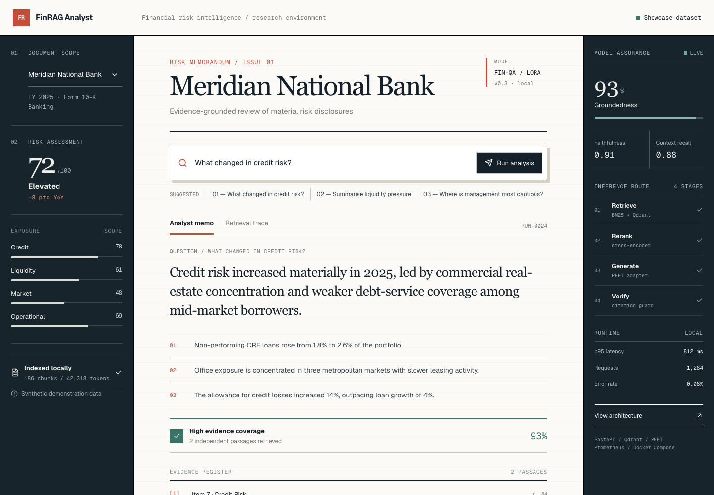
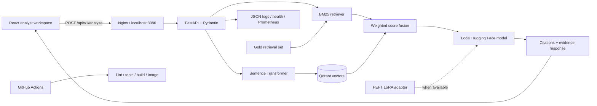

# FinRAG Analyst

**A self-hosted financial-risk research system that answers questions about filings, cites its evidence, exposes its retrieval trace, and can serve a locally fine-tuned LLM.**

> **Public showcase edition.** This repository is fully runnable and contains the product, API, sample fine-tuning path, evaluation fixture, and self-hosted deployment. The private companion edition additionally retains an extended training recipe, adversarial evaluation cases, and proposed operating targets; those assets are described below but are not represented as public or as measured production results.



FinRAG Analyst is an end-to-end AI engineering portfolio project. It combines a distinctive analyst workspace with a typed FastAPI service, hybrid retrieval, Qdrant, Hugging Face inference, PEFT/LoRA fine-tuning, measurable evaluation, operational telemetry, containers, and CI.

No paid model API is required. The full stack runs on your machine and keeps documents, embeddings, prompts, and model output local.

> **Data and claims:** every company, filing, figure, answer, and operational metric shown here is synthetic. This repository demonstrates engineering decisions; it does not provide investment advice or claim production model performance.

## Why this project exists

Financial analysts spend substantial time finding the few disclosures that explain a change in risk. A generic chatbot may produce fluent text while obscuring where a claim came from. FinRAG treats evidence as part of the product contract:

1. scope every question to one filing;
2. retrieve relevant passages with lexical and semantic search;
3. generate only from the retrieved context;
4. attach inspectable citations to the answer;
5. expose the pipeline trace and operational signals;
6. evaluate retrieval separately from generation.

That makes the system useful as both a product demonstration and an interview-ready discussion of model, data, API, UX, and deployment trade-offs.

## What is implemented

- A responsive React 19 and TypeScript research interface.
- A FastAPI service with validated request and response models.
- A deterministic BM25 baseline that works offline and is easy to debug.
- Optional hybrid retrieval using Sentence Transformers and persistent Qdrant vectors.
- Local generation with `Qwen/Qwen2.5-0.5B-Instruct`.
- Automatic loading of a trained PEFT adapter when `adapter_config.json` exists.
- A reproducible supervised LoRA training path and synthetic training fixture.
- Evidence citations, filing metadata filters, confidence display, and retrieval trace.
- Structured request logs, request IDs, health checks, error handling, and Prometheus metrics.
- Unit and API tests, retrieval evaluation, linting, builds, and container validation in CI.
- A three-service Docker Compose deployment bound to localhost.

## Architecture



### Request path

```text
question + filing_id
        ↓
metadata-constrained BM25 and dense retrieval
        ↓
45% sparse score + 55% semantic score
        ↓
top-k evidence with source identifiers
        ↓
local base model or LoRA-adapted model
        ↓
answer + citations + risk profile + trace
```

The filing filter is applied inside retrieval, not appended to the prompt. That prevents evidence from one issuer leaking into an answer about another.

## Run the complete self-hosted stack

### Recommended: Docker Compose

Prerequisites: Docker Desktop with at least 8 GB of memory available. A GPU is optional.

```bash
./scripts/start-local.sh
```

Then open:

- Workspace: `http://localhost:8080`
- API documentation: `http://localhost:8000/docs`
- Qdrant dashboard: `http://localhost:6333/dashboard`
- Prometheus metrics: `http://localhost:8080/metrics`

On first startup, Hugging Face downloads the default 0.5B model into a named Docker volume. Subsequent runs reuse the cache. Stop the stack with:

```bash
./scripts/stop-local.sh
```

All published ports bind to `127.0.0.1`, so the stack is not exposed to the surrounding network by default.

### Lightweight development mode

Use this mode for interface work or API debugging without downloading a model:

```bash
cp .env.example .env
npm ci
python -m venv .venv
source .venv/bin/activate
pip install -e './api[dev]'
```

Run the API:

```bash
uvicorn app.main:app --app-dir api --reload --port 8000
```

In a second terminal, run the web app:

```bash
npm run dev
```

Open `http://localhost:3000`. The API uses the extractive provider in this mode, so results are deterministic and fast.

## Runtime modes

| Mode              | Retrieval       | Generation              | Best use                                |
| ----------------- | --------------- | ----------------------- | --------------------------------------- |
| Browser showcase  | Curated fixture | Curated response        | Portfolio browsing with no backend      |
| Lightweight local | BM25            | Extractive              | Development, tests, retrieval debugging |
| Full local        | BM25 + Qdrant   | Hugging Face base model | Complete self-hosted demonstration      |
| Fine-tuned local  | BM25 + Qdrant   | PEFT LoRA adapter       | Domain-adaptation experiment            |

The response schema stays the same across modes. This isolates product and API work from model-provider changes.

## API contract

| Method | Route             | Purpose                                      |
| ------ | ----------------- | -------------------------------------------- |
| `GET`  | `/health`         | Service, corpus, and active generator status |
| `GET`  | `/api/v1/filings` | Indexed filing metadata                      |
| `POST` | `/api/v1/analyze` | Answer, citations, risk profile, and trace   |
| `GET`  | `/metrics`        | Prometheus-compatible counters and latency   |

Example request:

```bash
curl -X POST http://localhost:8000/api/v1/analyze \
  -H 'Content-Type: application/json' \
  -H 'X-Request-ID: interview-demo-01' \
  -d '{"filing_id":"meridian","question":"What changed in credit risk?"}'
```

Representative response shape:

```json
{
  "request_id": "...",
  "filing_id": "meridian",
  "answer": "Credit risk deteriorated...",
  "bullets": ["Non-performing CRE loans increased..."],
  "citations": [
    {
      "chunk_id": "meridian-credit-01",
      "section": "Item 7 · Credit Risk",
      "page": 84,
      "quote": "Commercial real estate non-performing loans...",
      "score": 0.94
    }
  ],
  "groundedness": 0.93,
  "risk_score": 72,
  "risk_level": "Elevated",
  "exposure": [],
  "trace": [],
  "model_provider": "huggingface-lora"
}
```

## Retrieval design

The baseline tokenizes query and filing chunks, then ranks them with BM25. It remains the default in tests because it is deterministic, explainable, and requires no model download.

Full mode adds `sentence-transformers/all-MiniLM-L6-v2` embeddings and Qdrant. The hybrid retriever combines normalized sparse and dense scores:

```text
hybrid_score = 0.45 × bm25_score + 0.55 × dense_cosine_score
```

This simple weighted fusion is deliberately readable. A production experiment could replace it with reciprocal-rank fusion and add a cross-encoder reranker, but doing so should be justified by measured gains rather than architecture decoration.

## Fine-tuning with LoRA

The training fixture teaches three domain behaviors:

- answer only from supplied evidence;
- quantify financial changes precisely;
- cite the source identifier and abstain when evidence is insufficient.

To train the included adapter:

```bash
cd api
pip install -e '.[training]'
python training/train_lora.py
python training/infer_adapter.py
```

The trainer freezes the base model and learns low-rank updates for transformer linear layers. It saves the adapter and tokenizer under `api/artifacts/finqa-lora` instead of duplicating the full base model.

At API startup, the Hugging Face provider checks for `adapter_config.json`:

- when present, it loads the PEFT adapter;
- when absent, it falls back to the configured base model;
- extractive mode remains available for fast tests and low-resource development.

The sample training data proves that the training and serving path is wired correctly. It is far too small to support a quality claim. A credible next study would use licensed financial QA data, deduplicate by source document, hold out entire issuers, and compare base-versus-adapter factuality.

## Evaluation

Run the full local verification suite:

```bash
pytest api/tests
cd api && python -m evaluation.evaluate
npm run lint
npm run build
```

Current retrieval fixture:

| Metric               | Result |
| -------------------- | -----: |
| Gold questions       |      6 |
| Recall@3             |   1.00 |
| Mean reciprocal rank |   1.00 |

These values are regression checks on a deliberately small synthetic set. They do not estimate performance on real filings.

Generation should be evaluated separately with claim-level citation precision, unsupported-claim rate, abstention accuracy, and a human rubric for financial materiality. Separating retrieval and generation tells us whether a bad answer came from missing evidence or poor synthesis.

## Production-minded behavior

- Pydantic validates inputs and constrains the API schema.
- Unknown filing IDs fail explicitly instead of searching the whole corpus.
- Every request receives an `X-Request-ID` for log correlation.
- Logs are structured JSON and include status and duration.
- `/health` reports the active model provider and indexed-document count.
- `/metrics` exposes request count, error count, and rolling p95 latency.
- Containers run as non-root users where practical.
- Local ports bind only to loopback.
- The static interface remains usable when the API is unavailable, while labeling itself as showcase mode.

## Responsible AI and threat model

- **Prompt injection:** filing text must be treated as untrusted content; retrieved instructions never override the system policy.
- **Cross-document leakage:** retrieval is filtered by filing ID before ranking.
- **Fabricated citations:** the API returns quotes and source metadata from retrieved chunks, not model-authored references.
- **Overconfidence:** an answer without sufficient evidence should abstain; confidence shown in the interface is evidence coverage, not probability of correctness.
- **Financial misuse:** risk scores are illustrative heuristics, not credit ratings or investment recommendations.
- **Data governance:** public fixtures are synthetic; licensed or employer-owned documents should not be committed.

## Public showcase and private full edition

This project uses a transparent two-repository strategy:

| Repository       | Visibility | Contents                                                                                                                        |
| ---------------- | ---------- | ------------------------------------------------------------------------------------------------------------------------------- |
| Full edition     | Private    | Complete application plus extended training recipe, adversarial evaluation set, and operating targets                           |
| Showcase edition | Public     | Fully runnable application, sample LoRA path, synthetic data, tests, containers, screenshot, and complete technical explanation |

The public edition is intentionally useful on its own. Only selected experimental and governance assets are reserved; the README documents the full architecture without pretending that private files are public or that unmeasured results exist.

The public tree is generated from a committed snapshot so private files never enter its Git history:

```bash
./scripts/export-showcase.sh /absolute/path/to/finrag-analyst-showcase
cd /absolute/path/to/finrag-analyst-showcase
git init
git add .
git commit -m 'Publish FinRAG Analyst showcase edition'
```

## Design rationale

The interface avoids the familiar “AI chatbot” visual vocabulary. It is structured as an editorial risk memorandum:

- serif type for analysis and sans/mono type for system evidence;
- restrained paper, ink, red, and assurance-green palette;
- square rules and report numbering instead of floating rounded cards;
- an evidence register rather than chat bubbles;
- a visible model-assurance column and retrieval trace.

The design makes provenance and analyst judgment feel central rather than decorative.

## Interview walkthrough

A concise demonstration takes about 90 seconds:

1. Select a synthetic filing and point out the document boundary.
2. Ask a risk question and open the evidence register.
3. Explain that BM25 provides a reproducible baseline while Qdrant adds semantic recall.
4. Open the retrieval trace to show where latency and failure can be diagnosed.
5. Call `/health` or `/metrics` to demonstrate production concerns beyond the notebook.
6. Explain the base-model/LoRA adapter switch and why issuer-level holdouts matter.

The deeper interview notes live in [`docs/INTERVIEW_GUIDE.md`](docs/INTERVIEW_GUIDE.md).

## Repository map

```text
app/                       React analyst workspace
components/ui/             accessible interface primitives
api/app/                   FastAPI, retrieval, generation, metrics
api/data/                  synthetic filing chunks
api/evaluation/            gold questions and retrieval metrics
api/training/              LoRA trainer, inference script, sample data
deploy/nginx.conf          local web server and API reverse proxy
private/                   private-edition experiments and governance assets
scripts/                   local-stack and showcase-export helpers
.github/workflows/         CI and optional static Pages deployment
compose.yaml               complete self-hosted stack
Dockerfile                 lightweight API image
Dockerfile.full            semantic retrieval + local LLM image
Dockerfile.web             static web image
```

## Deliberate scope choices

Kubernetes is omitted. Three containers on one machine do not need a cluster, and Compose makes the operational boundary easy to understand. Kubernetes would become appropriate only with multiple replicas, rolling deployment requirements, autoscaling, or an organizational platform that already standardizes it.

Authentication, document upload, background ingestion, and real regulatory filings are also outside the current scope. They are natural next increments after measuring retrieval and generation on an appropriate licensed dataset.

## License

MIT. See [`LICENSE`](LICENSE).
